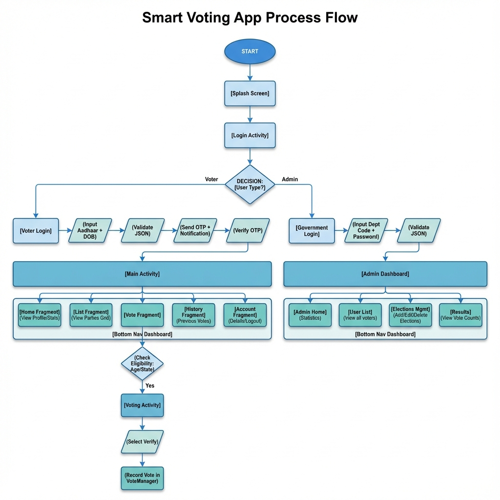
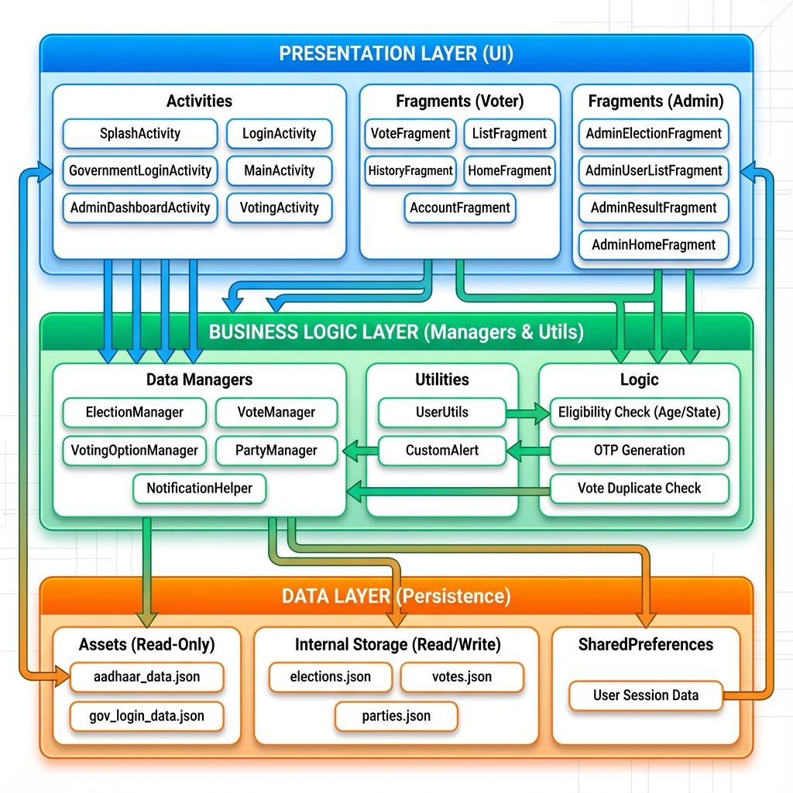
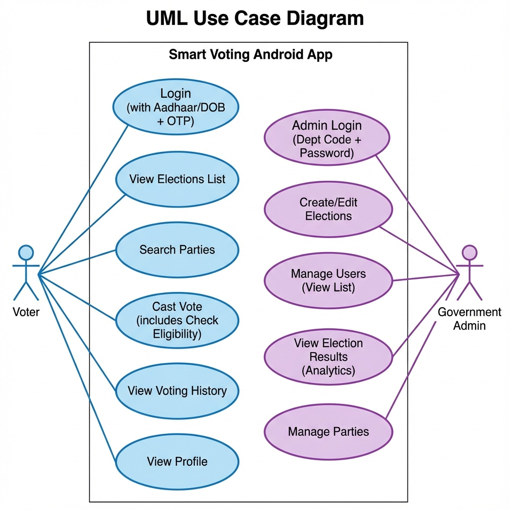

# Smart Voting Platform: Visual Workflow & Implementation Report

This document outlines the visual workflow and technical implementation of the Smart Voting App, referencing the core system diagrams.

---

## 1. End-to-End Project Workflow

### **Workflow Explanation**
The application workflow follows a strictly defined path for two distinct user types: **Voters** and **Admins**.

1.  **Initialization**:
    *   The app launches with the **SplashActivity**, which performs a fast initialization layout before fading into the Login screen.
2.  **Authentication Phase**:
    *   **Voter Path**: The user inputs their Aadhaar ID. The system validates the ID format and cross-references it with the local `aadhaar_data.json` asset. Upon success, an OTP simulation verifies the user.
    *   **Admin Path**: A secure link navigates to `GovernmentLoginActivity`. Here, officials authenticate using Department Codes verified against `gov_login_data.json`.
3.  **Core Operation (Voter)**:
    *   On the **Dashboard (MainActivity)**, the `ElectionManager` filters elections based on the user's registered state.
    *   When a user attempts to enter an election, **Eligibility Checks** run immediately (Age >= 18).
    *   **Voting**: Inside `VotingActivity`, the user selects a candidate (`VotingOption`). The `VoteManager` performs a critical **Duplicate Check** against `votes.json`. If clean, the vote is strictly serialized as a `VoteRecord` with a timestamp.
4.  **Admin Operations**:
    *   The **AdminDashboard** aggregates data from `votes.json` to visualize results and manage upcoming elections.

---

## 2. System Architecture & Components

### **Architecture Explanation**
The system uses a highly modular **Model-View-Manager** architecture designed for offline stability.

*   **View Layer (UI)**:
    *   `VotingActivity` acts as the primary secure interface.
    *   Fragments like `VoteFragment` and `ListFragment` handle the dynamic display of elections and parties.
*   **Business Logic (Managers)**:
    *   **Singletons** are used extensively. `VoteManager` is the specialized guardian of the vote database. `ElectionManager` handles the read-only election definitions.
    *   **NotificationHelper** bridges the logic and UI, providing system-level alerts for successful actions.
*   **Data Persistence (JSON)**:
    *   Unlike traditional SQL apps, this platform uses a lightweight **File I/O** system.
    *   Write-heavy data (Votes, Feedback) is stored in the device's **Internal Private Storage**, ensuring it is sandboxed from other apps.
    *   Static data (Aadhaar db) is bundled as **Assets**.

---

## 3. User Interaction & Use Cases

### **Use Case Explanation**
The system is defined by two primary Actors:

**A. The Voter**
*   **Authenticate**: The primary gatekeeping function.
*   **Cast Vote**: The central action, which `includes` the "Check Eligibility" and "Verify Identity" sub-cases.
*   **View History**: Allows transparency for the user to see their past participation.

**B. The Administrator**
*   **Manage Elections**: A CRUD (Create, Read, Update, Delete) capability to control the election lifecycle.
*   **View Results**: A strict read-only operation that aggregates the `VoteRecord` data to determine winners.

---

## **How to Export this Report to PDF**

Since this report contains embedded high-resolution diagrams from your local codebase:
1.  **VS Code / Cursor**: Open this file, press `Cmd+Shift+P`, search for **"Markdown: Open Preview"**, then right-click the preview and select **"Print"** -> **"Save as PDF"**.
2.  **Browser**: You can generate an HTML version and print that to PDF.

*Report generated by Antigravity.*
