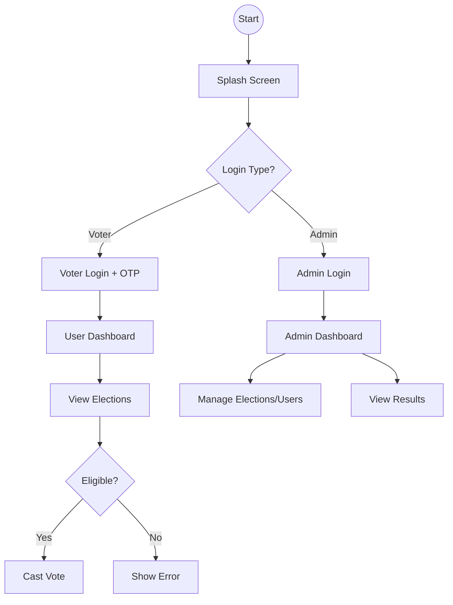
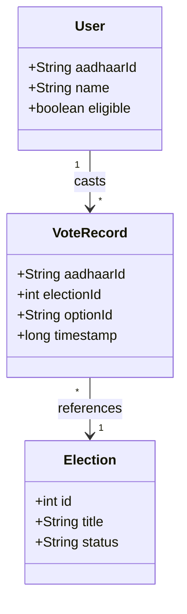

# Smart Voting App - Simplified Technical Diagrams

This document contains simplified, high-level diagrams of the Smart Voting App structure, designed for easy understanding.

## 1. 🔄 Simple Flow Chart



## 2. 🏗️ Simple System Architecture

```mermaid
graph TD
    subgraph Presentation_Layer [Presentation Layer (UI)]
        UI1[Activities: Login, Main, Vote]
        UI2[Fragments: Home, List, History]
    end

    subgraph Logic_Layer [Business Logic Layer]
        Manager1[VoteManager]
        Manager2[ElectionManager]
        Manager3[PartyManager]
        Util[Eligibility Check]
    end

    subgraph Data_Layer [Data Layer]
        File1[votes.json]
        File2[elections.json]
        File3[aadhaar_data.json]
    end

    Presentation_Layer --> Logic_Layer
    Logic_Layer --> Data_Layer
```

## 3. 👥 Simple Use Case Diagram

```mermaid
usecaseDiagram
    actor Voter
    actor Admin

    package Smart_Voting_App {
        usecase "Login & Verify OTP" as UC1
        usecase "View Elections" as UC2
        usecase "Cast Vote" as UC3
        usecase "View History" as UC4
        
        usecase "Admin Login" as UC5
        usecase "Manage Elections" as UC6
        usecase "View Results" as UC7
    }

    Voter --> UC1
    Voter --> UC2
    Voter --> UC3
    Voter --> UC4

    Admin --> UC5
    Admin --> UC6
    Admin --> UC7
```

## 4. 🧩 Simple Class Diagram (Core Models)



---

## 📂 Visual Diagrams

Typically, highly detailed diagrams can be complex. The **Mermaid** diagrams above are designed to be:
- **Simple**: Focus on high-level structure.
- **Clear**: Easy to read flow.
- **Accurate**: Based strictly on the existing Java code.

You can view these diagrams in any Markdown viewer that supports Mermaid (like GitHub, GitLab, or VS Code).
